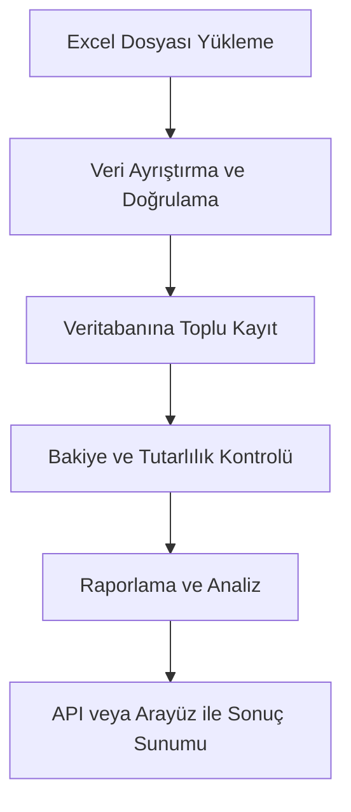

# Ekstre Uygulaması Özellik Raporu

## Genel Bakış

Bu uygulama, cari hesap ekstrelerinin Excel dosyalarından toplu olarak içe aktarılması, veritabanında saklanması ve gelişmiş raporlama ile analiz edilmesi için geliştirilmiştir. Temel olarak finansal işlemlerin, müşteri bakiyelerinin ve hareketlerinin yönetimini ve raporlanmasını sağlar.

---

## 1. Excel'den Veri İçe Aktarma

- **Excel Dosyası Yükleme:** Kullanıcılar, arayüz veya API üzerinden Excel dosyalarını yükleyebilir.
- **Otomatik Müşteri Tanıma:** Excel'deki müşteri başlıkları otomatik olarak algılanır ve yeni müşteri kaydı açılır veya mevcut müşteri güncellenir.
- **İşlem Satırlarının Analizi:** Her müşteri için işlem satırları (tarih, belge türü, açıklama, borç/alacak tutarları vb.) ayrıştırılır ve veritabanına toplu olarak eklenir.
- **Toplu ve Hızlı İşleme:** İşlemler 100'lük gruplar halinde toplu olarak işlenir, böylece büyük dosyalar hızlıca aktarılır.
- **Bakiye Doğrulama:** Excel'den okunan müşteri bakiyeleri ile veritabanındaki hesaplanan bakiyeler karşılaştırılır, farklar raporlanır.
- **Hata Yönetimi:** Hatalı satırlar atlanır ve detaylı hata raporları tutulur.
- **Geriye Dönük Uyumluluk:** Eski formatlar için legacy import fonksiyonu da mevcuttur.

---

## 2. Müşteri ve İşlem Yönetimi

- **Müşteri Kayıtları:** Her müşteri için kod, isim, telefon, adres, hesap tipi gibi bilgiler tutulur.
- **İşlem Kayıtları:** Her işlem için müşteri, belge türü, tarih, açıklama, borç/alacak, döviz cinsi gibi detaylar saklanır.
- **Bakiye Hesaplama:** Her müşteri için toplam borç, alacak ve net bakiye otomatik hesaplanır.
- **İşlem Kaynağı Takibi:** Her işlem, hangi dosyadan ve hangi satırdan geldiğiyle birlikte saklanır (izlenebilirlik).

---

## 3. Raporlama Özellikleri

### 3.1. Genel Özet Raporu (`/dashboard`)

- Sistemdeki toplam müşteri ve işlem sayısı
- Toplam borç, alacak ve net tutar
- Borçlu, alacaklı ve bakiyesi sıfır olan müşteri sayıları
- En çok borçlu ve alacaklı müşteriler
- Aylık işlem trendi
- Belge türüne göre işlem dağılımı

### 3.2. Yaşlandırma Analizi

- Müşteri bakiyelerinin vade tarihine göre yaşlandırılması (ör. 0-30, 31-60 gün gecikmeli bakiyeler)

### 3.3. Trend Analizi (`/trend-analysis`)

- İşlem hacminin zamana göre (gün/hafta/ay) değişimi
- Belirli bir müşteri veya tüm sistem için analiz

### 3.4. Müşteri Özeti (`/customer-summary/:code`)

- Seçili müşteri için toplam işlem, borç, alacak, bakiye
- Son 10 işlem listesi
- Belge türüne göre dağılım
- Aylık bakiye ve işlem trendi

### 3.5. Müşteri Listesi (`/customer-list`)

- Tüm müşterilerin bakiyeleri, işlem sayıları, iletişim bilgileri
- Bakiye aralığı, hesap tipi, sıralama ve sayfalama desteği

### 3.6. Detaylı Müşteri Raporu (`/customer-detail/:code`)

- Seçili müşteri için tüm işlemler, kaynak dosya bilgileriyle birlikte
- Belge türü ve aylık özetler
- PDF formatı için uygun veri çıktısı

---

## 4. API ve Entegrasyon

- **RESTful API:** Tüm raporlar ve veri işlemleri API üzerinden erişilebilir.
- **Excel Rapor Çıktısı:** Raporlar Excel dosyası olarak dışa aktarılabilir.
- **Hata ve Durum Kodları:** Tüm uç noktalar detaylı hata mesajları ve durum kodları döner.

---

## 5. Teknik Özellikler

- **Veritabanı:** Prisma ORM ile ilişkisel veritabanı kullanımı
- **Toplu İşlem:** Yüksek hacimli veri için batch (toplu) işleme
- **Günlükleme:** Hatalar ve önemli işlemler loglanır
- **Çoklu Dosya ve Kaynak Takibi:** Her işlem ve bakiye, hangi dosyadan geldiğiyle birlikte izlenebilir

---

## 6. Kullanım Senaryoları

- Muhasebe departmanları için toplu ekstre yükleme ve analiz
- Müşteri bakiyelerinin hızlıca kontrolü ve raporlanması
- Finansal veri tutarlılığının otomatik kontrolü
- Dış sistemlerle entegrasyon için API tabanlı veri erişimi

---

## 7. Güvenlik ve Hata Yönetimi

- Yüklenen dosyalar geçici dizinde saklanır ve işlendikten sonra temizlenir
- Hatalı satırlar ve işlemler detaylı şekilde raporlanır
- Her işlem ve müşteri için güncelleme ve ekleme işlemleri atomik olarak yapılır

---

## 8. Ek Özellikler

- **Etiketleme ve Sınıflandırma:** Müşteriler için etiket alanları (tag1, tag2) ile segmentasyon
- **Döviz Desteği:** İşlemler için döviz cinsi takibi (varsa)
- **Gelişmiş Filtreleme:** Raporlarda tarih, bakiye, hesap tipi gibi filtreler

---

## 9. API Uç Noktaları ve Açıklamaları

### 9.1. İçe Aktarma (Import)

- **POST `/imports/excel`**
  - Excel dosyasını yükler ve işlemleri veritabanına aktarır.
  - Yanıt olarak, yüklenen dosyanın işlenme durumu ve özet rapor döner.
  - Hatalı satırlar ve işlenemeyen kayıtlar detaylı şekilde raporlanır.

- **GET `/imports/:id`**
  - Belirli bir içe aktarma işleminin detaylarını ve müşteri bakiyelerini getirir.

### 9.2. Raporlama

- **GET `/reports/dashboard`**
  - Genel sistem özeti, müşteri ve işlem istatistikleri, bakiye dağılımı, aylık trend, belge türü kırılımı.

- **GET `/reports/trend-analysis`**
  - Zaman bazlı (gün/hafta/ay) işlem hacmi ve bakiye trendi.
  - Parametreler: `from`, `to`, `customerCode`, `groupBy`.

- **GET `/reports/customer-summary/:code`**
  - Seçili müşteri için özet rapor, son işlemler, belge türü dağılımı, aylık trend.

- **GET `/reports/customer-list`**
  - Tüm müşterilerin bakiyeleri, işlem sayıları, filtreleme ve sıralama seçenekleriyle.

- **GET `/reports/customers`**
  - Basit müşteri listesi (arama ve seçim için).

- **GET `/reports/customer-detail/:code`**
  - Seçili müşteri için tüm işlemler, kaynak dosya bilgileri, belge türü ve aylık özetler.
  - PDF formatı için uygun veri çıktısı.

### 9.3. Diğer

- **GET `/docs`**
  - API dokümantasyonu (Swagger/OpenAPI arayüzü).

---

## 10. Sistem Mimarisi ve Akış

- **Excel Yükleme:** Kullanıcı dosya yükler.
- **Ayrıştırma:** Satırlar okunur, müşteri ve işlemler ayrıştırılır.
- **Kayıt:** Veritabanına toplu ve atomik olarak eklenir.
- **Kontrol:** Bakiye ve tutarlılık kontrolleri yapılır, farklar raporlanır.
- **Raporlama:** Kullanıcıya özet, detay ve trend raporları sunulur.

---

## 11. Kullanıcıya Sağlanan Faydalar

- **Hızlı ve Hatasız Veri Aktarımı:** Büyük hacimli ekstreler kolayca sisteme alınır.
- **Otomatik Müşteri ve İşlem Eşleştirme:** Manuel veri girişi ihtiyacı ortadan kalkar.
- **Gelişmiş Raporlama:** Anlık finansal analiz ve müşteri bazlı detaylı raporlar.
- **Tutarlılık ve Güven:** Bakiye farkları ve hatalar anında tespit edilir.
- **Kolay Entegrasyon:** API ile diğer sistemlere kolayca bağlanabilir.

---

## 12. Geliştirilebilir Alanlar ve Ekstra Notlar

- **Kullanıcı Yetkilendirme:** Şu anki kodda kimlik doğrulama/rol bazlı erişim yok, eklenebilir.
- **Döviz Kurları:** Çoklu döviz desteği temel seviyede, ileri seviye kur yönetimi eklenebilir.
- **Bildirimler:** İçe aktarma ve raporlama sonrası e-posta veya sistem içi bildirimler eklenebilir.
- **Görsel Raporlar:** Grafik ve dashboard arayüzleriyle zenginleştirilebilir.

---

## 13. Dosya ve Klasör Yapısı (Özet)

- **src/importer/**: Excel içe aktarma ve ayrıştırma kodları
- **src/routes/**: API uç noktaları (imports, reports, transactions, docs)
- **src/utils/**: Yardımcı fonksiyonlar (tarih, para, hash vb.)
- **prisma/**: Veritabanı şeması ve migration dosyaları
- **public/**: Statik HTML raporlar (gelişmiş raporlar için)

---

## 14. Sonuç

Bu uygulama, finansal veri yönetimi ve raporlama süreçlerini otomatikleştirerek, kullanıcıya zaman ve güvenlik kazandırır. Esnek API yapısı ve gelişmiş raporlama seçenekleriyle, hem küçük işletmeler hem de büyük kurumlar için uygundur.

---

Daha fazla teknik detay, kod örneği veya belirli bir özelliğin derinlemesine açıklamasını isterseniz belirtmeniz yeterli!